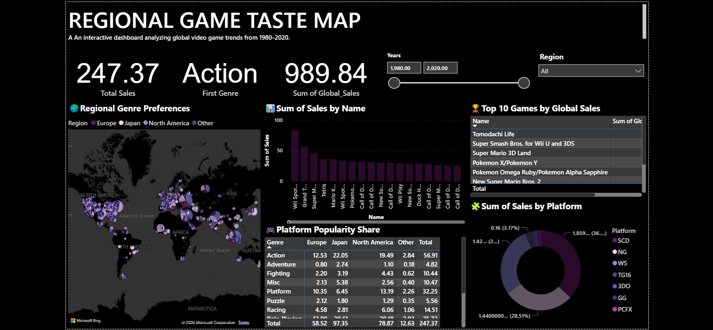

# 🎮 Regional Game Taste (Power BI)

An interactive Power BI dashboard analyzing game genre trends across different global regions (1980–2020).

## 📊 Dashboard Features
- 🌍 Regional genre heatmap
- 📈 Sales by year, platform, and top games
- 🎮 Genre preferences by region
- ⏳ Dynamic year range filtering

## 📁 Files Included
- `vgsales.csv`: Cleaned dataset of global game sales
- `game.pbix`: Power BI project file

## 🖼️ Preview

## 🚀 How to Use
1. Download the `.pbix` file
2. Open it in Power BI Desktop
3. Explore, filter, and enjoy 🎉

## 💡 Inspiration
This project showcases interactive analytics and storytelling in gaming data, blending technical skills with visual design.

